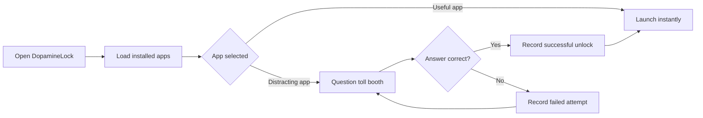

<div align="center">


<br />


</div>

---

## What Is DopamineLock?

**DopamineLock** is a productivity-focused Android launcher built with Flutter. It lists installed apps, launches normal apps directly, and places a small "toll booth" in front of distracting apps like YouTube, Instagram, TikTok, Snapchat, X, and Facebook.

Before opening a distracting app, the user must answer a quick knowledge question. Correct answers unlock the app; wrong answers ask the user to pause and try again. The result is not a hard block, but a mindful interruption that makes impulse opening more intentional.

---

## Visual Flow



---

## Highlights

| Feature | What it does |
| --- | --- |
| Android launcher grid | Reads installed launchable apps through a native Kotlin method channel. |
| App icons | Converts Android drawables to PNG bytes and renders them inside Flutter. |
| Distraction toll booth | Shows a required question before opening selected high-distraction apps. |
| Offline-first questions | Seeds questions in SQLite so the app still works without the backend. |
| Attempt tracking | Records unlock count, failed attempts, answered questions, and last unlock time. |
| FastAPI sync layer | Exposes endpoints for question sync and future stats persistence. |

---

## Tech Stack

<div align="center">


</div>

| Layer | Tools |
| --- | --- |
| Mobile app | Flutter, Dart, Material 3 |
| Android bridge | Kotlin, Flutter MethodChannel |
| Local storage | SQLite through `sqflite` |
| API backend | Python, FastAPI, Pydantic, Uvicorn |
| Networking | Flutter `http` package |

---

## Project Structure

```text
Dopamine_lock_launcher/
+-- dopamine_lock_launcher/      # Flutter Android launcher app
|   +-- lib/
|   |   +-- database/            # SQLite setup, seed data, stats
|   |   +-- models/              # Question model
|   |   +-- screens/             # Home launcher grid
|   |   +-- services/            # Native launcher + question sync service
|   |   +-- widgets/             # Unlock toll booth dialog
|   +-- android/
|       +-- app/src/main/kotlin/ # Native Android app discovery and launch code
+-- dopamine_lock_backend/       # FastAPI sync API
```

---

## Getting Started

### Prerequisites

- Flutter SDK
- Android Studio or Android SDK
- Python 3.11+
- Android emulator or physical Android device

### Run The Backend

```bash
cd dopamine_lock_backend
python -m venv .venv
.venv\Scripts\activate
pip install -r requirements.txt
uvicorn main:app --reload
```

The API will run at:

```text
http://127.0.0.1:8000
```

Useful endpoints:

```text
GET  /health
GET  /sync/questions
POST /sync/stats
```

### Run The Flutter App

```bash
cd dopamine_lock_launcher
flutter pub get
flutter run
```

For Android emulator testing, the app syncs questions from:

```text
http://10.0.2.2:8000
```

That address maps the emulator back to your local machine.

---

## How It Works

1. Flutter starts `HomeScreen` and asks the native Android layer for installed launchable apps.
2. Kotlin filters system apps, extracts app names, package names, and icons, then returns them to Flutter.
3. Tapping a normal app launches it immediately.
4. Tapping a distracting app opens `TollBoothDialog`.
5. A random question is loaded from SQLite.
6. Correct answers launch the selected app and record a successful unlock.
7. Wrong answers record a failed attempt and keep the toll booth active.

---

## Current Distracting App Targets

```text
Instagram
YouTube
TikTok
Snapchat
X / Twitter
Facebook
```

The package list lives in:

```text
dopamine_lock_launcher/lib/screens/home_screen.dart
```

---

## Roadmap

- Add a settings screen to customize blocked apps.
- Add difficulty levels for unlock questions.
- Sync user stats to a real database such as Supabase or PostgreSQL.
- Add streaks, focus summaries, and daily unlock charts.
- Add smoother launcher transitions and animated toll booth feedback.
- Package as a full Android launcher experience with home intent support.

---

## Repository Description

```text
A mindful Flutter Android launcher that adds a question-based toll booth before distracting apps, with offline SQLite storage and a FastAPI sync backend.
```

---

<div align="center">


</div>
