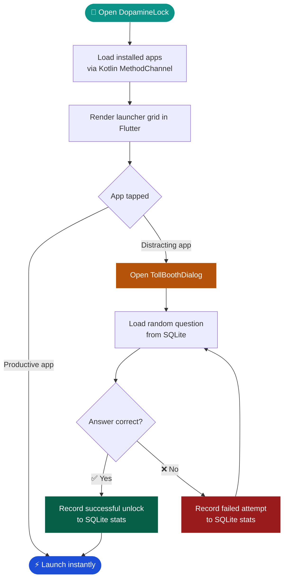

<!--
╔══════════════════════════════════════════════════════════════════════════════╗
║                         DOPAMINELOCK  ·  README.md                          ║
║          Elite GitHub README — swap every [ REPLACE ] comment below         ║
╚══════════════════════════════════════════════════════════════════════════════╝
-->

<!-- ═══════════════════════  HERO SECTION  ═══════════════════════ -->

<div align="center">

<!-- [ REPLACE ] Swap this capsule-render URL for your own if you want a
     different gradient. Current: dark navy → electric blue → teal wave. -->


<!-- [ REPLACE ] Drop in a real demo GIF here (screen-record on emulator,
     export at ≤ 4 MB for fast GitHub loading). Recommended: 390 × 844 px. -->
<!--  -->

<br />

<!-- Animated typing tagline -->


<br /><br />

<!-- ── Dynamic Shields Row ── -->
<!-- [ REPLACE ] Update YOUR_USERNAME/YOUR_REPO in every shields.io badge URL -->


<br />

<!-- [ REPLACE ] YOUR_USERNAME / YOUR_REPO everywhere below -->
[](https://github.com/YOUR_USERNAME/YOUR_REPO/stargazers)
[](https://github.com/YOUR_USERNAME/YOUR_REPO/network/members)
[](https://github.com/YOUR_USERNAME/YOUR_REPO/issues)
[](https://github.com/YOUR_USERNAME/YOUR_REPO/commits/main)
[](LICENSE)

<!-- [ REPLACE ] Add your real GitHub Actions workflow badge file name below -->
<!-- [](https://github.com/YOUR_USERNAME/YOUR_REPO/actions/workflows/ci.yml) -->

<br />

[**Live Demo**](#-quick-start) · [**Features**](#-feature-showcase) · [**Architecture**](#-architecture) · [**Contribute**](#-contributing) · [**Roadmap**](#-roadmap)

</div>

---

<!-- ═══════════════════════  VALUE PROPOSITION  ═══════════════════════ -->

## 🧠 What Is DopamineLock?

> **One-line pitch:** DopamineLock is a mindful Flutter Android launcher that replaces mindless app-opens with a micro-knowledge challenge — so every scroll session starts with a conscious choice.

Most screen-time apps **block** apps entirely — which causes frustration and instant uninstall.  
DopamineLock does something smarter: it places a **question toll booth** only in front of high-distraction apps (YouTube, Instagram, TikTok, etc.) while letting every productive app launch instantly.  

Answer correctly → you get in. Answer wrongly → pause and reconsider.  
**It's not a blocker. It's a mindfulness interrupt.**

<br />

<!-- ═══════════════════════  FEATURE SHOWCASE  ═══════════════════════ -->

## ✨ Feature Showcase

<div align="center">

<!-- Feature grid — 3 columns on desktop, stacks on mobile -->
<table>
<tr>
<td align="center" width="33%">

### 🚦 Toll Booth Dialog
A beautiful question modal fires **before** any distracting app opens. Wrong answers keep the gate closed and log the failed attempt.

</td>
<td align="center" width="33%">

### ⚡ Instant Productive Launch
Whitelisted apps (calculator, maps, notes, etc.) open with **zero friction**. No question, no delay.

</td>
<td align="center" width="33%">

### 📦 Offline-First SQLite
Questions are seeded locally via **SQLite + sqflite**. The app runs 100% without a network connection.

</td>
</tr>
<tr>
<td align="center" width="33%">

### 🔄 FastAPI Sync Layer
A lightweight **Python FastAPI** backend syncs fresh question packs and persists stats for future cloud features.

</td>
<td align="center" width="33%">

### 📊 Attempt Tracking
Every unlock attempt — success or failure — is recorded locally: count, timestamps, questions answered, and streak data.

</td>
<td align="center" width="33%">

### 🤖 Native Android Bridge
A **Kotlin MethodChannel** reads real installed apps, extracts icons as PNG bytes, and feeds them directly to Flutter.

</td>
</tr>
</table>

</div>

---

<!-- ═══════════════════════  TECH STACK  ═══════════════════════ -->

## 🛠 Tech Stack

<div align="center">


</div>

<br />

<div align="center">

| Layer | Technology | Role |
|---|---|---|
| 📱 **Mobile UI** | Flutter · Dart · Material 3 | Launcher grid, toll booth dialog, stats UI |
| 🤝 **Native Bridge** | Kotlin · MethodChannel | App discovery, icon extraction, app launch |
| 🗄️ **Local Storage** | SQLite · `sqflite` | Questions, attempt tracking, offline seed data |
| 🌐 **Sync API** | Python · FastAPI · Pydantic · Uvicorn | Question sync, future stats persistence |
| 📡 **Networking** | Flutter `http` package | REST calls to FastAPI backend |

</div>

---

<!-- ═══════════════════════  QUICK START  ═══════════════════════ -->

## 🚀 Quick Start

### Prerequisites

Ensure the following are installed before cloning:

| Tool | Version | Check |
|---|---|---|
| Flutter SDK | ≥ 3.x | `flutter --version` |
| Android Studio / SDK | Latest stable | `adb --version` |
| Python | ≥ 3.11 | `python --version` |
| Android device / emulator | API 26+ | — |

---

### 1 · Clone the Repository

```bash
# Clone and enter project root
git clone https://github.com/YOUR_USERNAME/YOUR_REPO.git
cd Dopamine_lock_launcher
```

---

### 2 · Start the FastAPI Backend

```bash
# Navigate to the backend directory
cd dopamine_lock_backend

# Create and activate a virtual environment
python -m venv .venv

# Windows
.venv\Scripts\activate

# macOS / Linux
source .venv/bin/activate

# Install dependencies
pip install -r requirements.txt

# Start the development server (hot-reload enabled)
uvicorn main:app --reload
```

The API will be live at:

```
http://127.0.0.1:8000
```

<details>
<summary><strong>📋 Available API Endpoints</strong></summary>

<br />

| Method | Endpoint | Description |
|---|---|---|
| `GET` | `/health` | Server health check |
| `GET` | `/sync/questions` | Fetch latest question pack |
| `POST` | `/sync/stats` | Push local unlock stats |

Interactive docs available at `http://127.0.0.1:8000/docs` (Swagger UI auto-generated by FastAPI).

</details>

---

### 3 · Run the Flutter App

```bash
# Navigate to the Flutter app directory
cd ../dopamine_lock_launcher

# Fetch all Dart / Flutter dependencies
flutter pub get

# Connect your Android device or start an emulator, then:
flutter run
```

> 💡 **Emulator note:** The app syncs questions from `http://10.0.2.2:8000` — this address automatically maps the Android emulator back to `localhost` on your dev machine.

---

<!-- ═══════════════════════  ARCHITECTURE  ═══════════════════════ -->

## 🏗 Architecture

### Visual Flow



---

### Project Structure

```text
Dopamine_lock_launcher/
├── dopamine_lock_launcher/          # 📱 Flutter Android launcher app
│   ├── lib/
│   │   ├── database/                # SQLite setup, seed questions, stats schema
│   │   ├── models/                  # Question model (Dart data class)
│   │   ├── screens/                 # HomeScreen — launcher grid UI
│   │   ├── services/                # NativeLauncherService + QuestionSyncService
│   │   └── widgets/                 # TollBoothDialog — the unlock modal
│   └── android/
│       └── app/src/main/kotlin/     # Native app discovery, icon extraction, launch
│
└── dopamine_lock_backend/           # 🌐 FastAPI sync API
    ├── main.py                      # App entry point, route registration
    ├── routers/                     # /sync/questions, /sync/stats endpoints
    ├── models/                      # Pydantic request/response schemas
    └── requirements.txt             # Python dependencies
```

---

### Data Flow Diagram

```
┌─────────────────────────────────────────────────────────┐
│                     Flutter Layer                        │
│  HomeScreen ──► TollBoothDialog ──► StatsTracker        │
│       │                │                  │              │
│  NativeLauncherSvc  QuestionRepo      SQLiteDB           │
└─────────┬───────────────┬──────────────────┬────────────┘
          │               │                  │
     Kotlin Bridge    SQLite (local)    HTTP Client
          │                                  │
  Android PackageManager            FastAPI Backend
  (reads installed apps)            /sync/questions
                                    /sync/stats
```

---

<!-- ═══════════════════════  DISTRACTING APPS  ═══════════════════════ -->

## 🎯 Default Distraction Targets

These package names are gated behind the toll booth out-of-the-box:

<div align="center">

| App | Package Name |
|---|---|
| 📸 Instagram | `com.instagram.android` |
| ▶️ YouTube | `com.google.android.youtube` |
| 🎵 TikTok | `com.zhiliaoapp.musically` |
| 👻 Snapchat | `com.snapchat.android` |
| 🐦 X / Twitter | `com.twitter.android` |
| 👍 Facebook | `com.facebook.katana` |

</div>

The full list lives in:

```
dopamine_lock_launcher/lib/screens/home_screen.dart
```

> 🔧 **Coming soon:** A settings screen to customize this list without touching code. See [Roadmap](#-roadmap).

---

<!-- ═══════════════════════  HOW IT WORKS  ═══════════════════════ -->

## ⚙️ How It Works

<details>
<summary><strong>Step-by-step runtime walkthrough</strong></summary>

<br />

**1. App Discovery**  
`HomeScreen` sends a call over `MethodChannel` to Kotlin. Kotlin queries `PackageManager` for all launchable non-system apps, extracts their name, package ID, and app icon (as PNG bytes), and returns the list to Flutter.

**2. Launcher Grid Render**  
Flutter builds a responsive `GridView` from the returned app list, rendering icons from raw bytes using `Image.memory`.

**3. Normal App Tap**  
Tapping any app not in the distraction list calls back to Kotlin, which fires an `Intent` with the package name. The app opens instantly.

**4. Distraction App Tap**  
Tapping a gated app opens `TollBoothDialog` — a full-screen modal with a randomly selected question loaded from **SQLite**.

**5. Correct Answer**  
- Logs a successful unlock (attempt count + timestamp) to the `stats` SQLite table.  
- Calls Kotlin to launch the app.

**6. Wrong Answer**  
- Logs a failed attempt to the `stats` SQLite table.  
- Reloads the dialog with the same (or a new) question — the gate stays closed.

**7. Optional Sync**  
On app start, `QuestionSyncService` pings `GET /sync/questions` on the FastAPI backend. New questions are upserted into SQLite, ensuring the question bank stays fresh without breaking offline functionality.

</details>

---

<!-- ═══════════════════════  ROADMAP  ═══════════════════════ -->

## 📍 Roadmap

```text
v1.0  ✅  Core launcher grid + toll booth dialog
v1.0  ✅  SQLite offline questions + attempt tracking
v1.0  ✅  FastAPI sync layer (questions + stats endpoints)
v1.1  🔲  Settings screen — add/remove blocked apps without code changes
v1.2  🔲  Difficulty levels — easy / medium / hard questions per app
v1.3  🔲  Supabase or PostgreSQL integration for cloud stats persistence
v1.4  🔲  Streaks, focus summaries, and daily unlock bar charts
v1.5  🔲  Animated toll booth feedback (correct/wrong answer micro-animations)
v2.0  🔲  Full Android home launcher (register as HOME intent handler)
```

---

<!-- ═══════════════════════  CONTRIBUTING  ═══════════════════════ -->

## 🤝 Contributing

Contributions are welcome and appreciated. Here's the fastest path from idea to merged PR:

```bash
# 1. Fork the repository on GitHub, then clone your fork
git clone https://github.com/YOUR_FORK/YOUR_REPO.git

# 2. Create a focused feature branch
git checkout -b feat/your-feature-name

# 3. Make your changes — keep commits atomic and descriptive
git commit -m "feat: add difficulty level selector to TollBoothDialog"

# 4. Push to your fork
git push origin feat/your-feature-name

# 5. Open a Pull Request against main on the original repo
```

**Contribution guidelines:**
- Open an **Issue** before starting large features — alignment first.
- Follow the existing **Flutter / Dart style** (run `flutter analyze` before pushing).
- All new questions added to the seed data must be factually accurate and cite a source in the PR description.
- Keep PR scope tight — one feature per PR moves faster.

---

<!-- ═══════════════════════  CONTRIBUTORS  ═══════════════════════ -->

## 🏆 Contributors

<!-- [ REPLACE ] contributors-img auto-generates this from your repo's contributor list.
     Swap YOUR_USERNAME/YOUR_REPO with your actual values. -->

<a href="https://github.com/YOUR_USERNAME/YOUR_REPO/graphs/contributors">
  
</a>

<br /><br />

> Be the first name on this wall. Open a PR today. ⭐

---

<!-- ═══════════════════════  REPO STATS  ═══════════════════════ -->

## 📈 Repository Stats

<!-- [ REPLACE ] YOUR_USERNAME in all stat card URLs below -->

<div align="center">


&nbsp;


</div>

---

<!-- ═══════════════════════  FOOTER  ═══════════════════════ -->

<div align="center">

<!-- [ REPLACE ] Swap gradient or text in this capsule-render footer URL as needed -->


<br />

**Made with 🧠 and Flutter**  
If DopamineLock helped you reclaim your focus, give it a ⭐ — it keeps the project alive.

[](https://star-history.com/#YOUR_USERNAME/YOUR_REPO&Date)

</div>